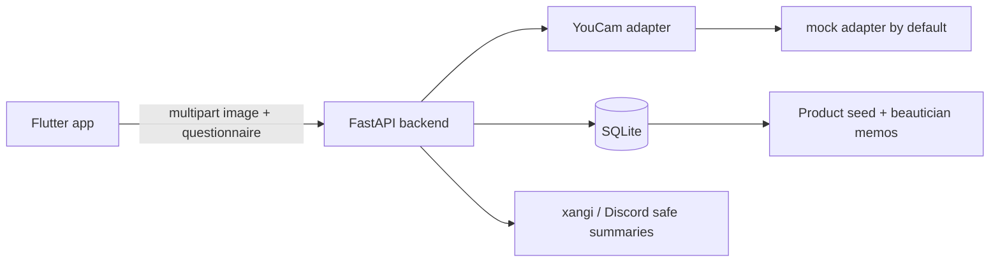

# skin-care-companion

元美容部員の知見を活かした、肌ケア伴走アプリ + xangi/Discord連携のMVPです。
Zennfes Spring 2026 / YouCam API 向けに、YouCam実キーがなくても mock モードで動く構成にしています。

> このアプリは医療診断ではなく、美容上の一般的なアドバイスを提供するMVPです。強い症状や治療判断が必要な場合は専門家へ相談してください。

## アーキテクチャ



顔写真は Flutter と FastAPI の分析処理だけで扱います。分析後に一時ファイルを削除し、SQLiteやxangi/Discord向けレスポンスには保存・送信しません。

## ディレクトリ

```text
apps/mobile/                 Flutterアプリ
apps/api/                    FastAPIバックエンド
apps/api/app/youcam/         YouCam adapter
apps/api/app/recommendation/ 推薦ロジック
apps/api/app/rag/            retriever interface / SQLite実装
apps/api/app/db/             SQLite schema / seed
docs/                        設計メモ、steering、Zenn記事下書き
skills/                      Codex向けスキル
```

## Backend セットアップ

```bash
cd apps/api
python3 -m venv .venv
source .venv/bin/activate
pip install -r requirements.txt
cp .env.example .env
uvicorn app.main:app --reload
```

mockモードは `.env` の `YOUCAM_MODE=mock` で有効です。YouCam実APIを試す場合だけ、バックエンド側の `.env` に `YOUCAM_MODE=real`、`YOUCAM_API_KEY`、`YOUCAM_ENDPOINT` を設定します。FlutterにはAPIキーを入れません。

## API確認

```bash
curl http://127.0.0.1:8000/health
curl http://127.0.0.1:8000/api/skin-logs/latest
curl http://127.0.0.1:8000/api/reports/weekly
```

`POST /api/skin/analyze` は multipart で `image` と `questionnaire` JSON文字列を送ります。Flutterアプリから呼び出すのが一番簡単です。

## Flutter セットアップ

```bash
cd apps/mobile
flutter pub get
flutter run --dart-define=API_BASE_URL=http://127.0.0.1:8000
```

Android emulator からローカルPCのAPIへつなぐ場合は次を使います。

```bash
flutter run --dart-define=API_BASE_URL=http://10.0.2.2:8000
```

## テスト

```bash
cd apps/api
PYTEST_DISABLE_PLUGIN_AUTOLOAD=1 pytest

cd ../mobile
flutter test
```

## .env

- `YOUCAM_MODE`: `mock` または `real`
- `YOUCAM_API_KEY`: YouCam APIキー。Flutterへ埋め込まない
- `YOUCAM_ENDPOINT`: YouCam API endpoint
- `LLM_API_KEY`: 将来のLLM連携用。Flutterへ埋め込まない
- `DISCORD_WEBHOOK_URL`: 将来のDiscord通知用
- `DATABASE_PATH`: SQLite DBパス
- `UPLOAD_DIR`: 画像一時保存ディレクトリ

## Zenn記事向けポイント

- API仕様が未確定でも adapter + mock でMVPを前に進められる。
- 顔写真をxangi/Discordへ流さず、要約APIだけを公開する。
- LLMに商品を捏造させず、SQLite seed に存在する商品だけ推薦する。
- Retriever interface を分けることで、SQLite FTSからベクトル検索へ差し替えやすい。
